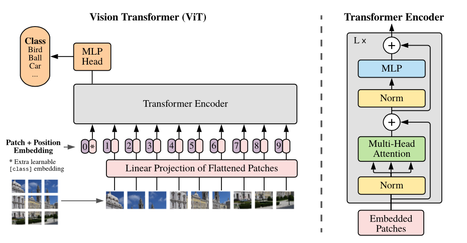

# ViT PyTorch

  

PyTorch implementation of Vision Transformer (ViT).

[Vision Transformer (ViT)](https://arxiv.org/abs/2010.11929) - An Image is Worth 16x16 Words: Transformers for Image Recognition at Scale.
